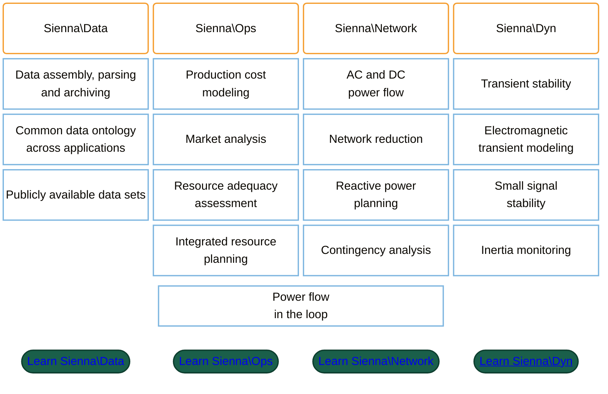

# [Sienna Documentation](@id documentation)

## Welcome to Sienna

The National Laboratory of the Rockies' [Sienna platform](https://sienna-
platform.github.io/Sienna/)
is an open-source framework for power systems planning, operations, and reliability modeling.

Sienna is a modular, extensible platform built in the [Julia](https://julialang.org/) programming
language.
Sienna is comprised of many Julia packages, organized
into applications:



```@raw html
<style>
article .mermaid svg .nodeLabel p,
article .mermaid svg .nodeLabel span,
article .mermaid svg .nodeLabel div,
article .mermaid svg .nodeLabel a,
article .mermaid svg .label text,
article .mermaid svg .label span,
article .mermaid svg foreignObject div {
  color: #ffffff !important;
}
article .mermaid svg .label text,
article .mermaid svg text {
  fill: #ffffff !important;
}
article .mermaid svg .edgePath .path,
article .mermaid svg .flowchart-link {
  stroke: #9ec5e8 !important;
}
article .mermaid svg .marker,
article .mermaid svg .arrowheadPath {
  fill: #9ec5e8 !important;
  stroke: #9ec5e8 !important;
}
article .mermaid svg g.node.gsBtn .label-container,
article .mermaid svg g.node.gsBtn path {
  min-height: 48px;
}
article .mermaid svg g.node.gsBtn foreignObject div {
  padding: 6px 4px;
}
</style>

```

Click the links above to get started with each application's package install instructions and
recommended learning pathway.

## How to Use This Documentation

This site is the central Sienna Documentation, including Sienna-wide how-tos (install, VS Code) plus
the documentation pages for the core Sienna packages, available via the top navigation dropdowns.

Throughout the Sienna documentation, we strive to follow
the [Diataxis](https://diataxis.fr/)
documentation framework. Within each package's documentation, there are four main sections
containing different information:

  - **Tutorials** - Detailed walk-throughs to help you *learn* how to use Sienna
  - **How to...** - Directions to help *guide* your work for a particular task
  - **Explanation** - Additional details and background information to help you *understand*
    Sienna, its structure, and how it works behind the scenes
  - **Reference** - Technical references and API for a quick *look-up* during your work

The package documentation pages from the dropdowns include the `stable` and `dev` versions. Use **See All Versions** on a package page for
full version history on GitHub Pages.
